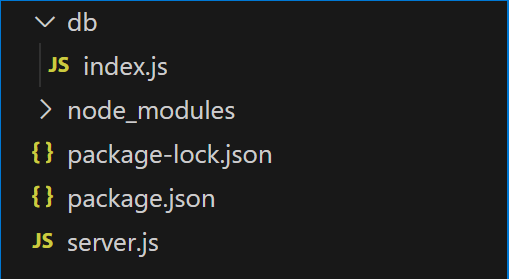
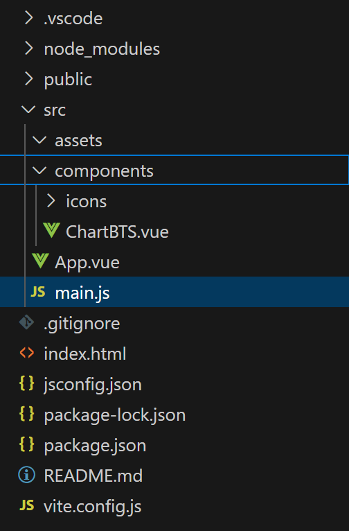
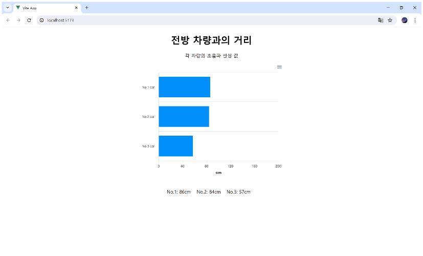

# Backend
---
## 1. Node.js 설치
Javascript가 동작하기 위해 Runtime인 Node.js를 설치합니다. 

https://nodejs.org/en 

<br>

## 2. nodemon 설치
nodemon은 node.js의 소스코드가 변경됐을 때, 자동으로 서버를 재시작해 결과를 즉시 확인할 수 있는 패키지입니다.

이 nodemon 패키지를 전역으로 설치합니다. 
```
npm i -g nodemon
``` 

<br>

## 3. Package (Web Application) 생성
작업 디렉토리를 만들고 ```npm init``` 명령어로 Web Application에서 필요한 기본 코드를 자동 생성합니다. (package.json)
```
mkdir [작업 디렉토리 이름]
cd [작업 디렉토리 이름]
npm init
```
더이상 물어보지 않을 때까지 enter를 눌러 모두 기본값으로 설정합니다.

```code .``` 으로 VS code를 실행합니다.

<br>

## 4. 추가 패키지 지역 설치
```
npm i express cors mysql2 socket.io
```
- express : Node.js 서버 개발을 위한 프레임워크
- cors : CORS 브라우저 보안 설정을 쉽게 할 수 패키지, 이 패키지를 사용하면, 보안 설정을 쉽게 할 수 있다.
- mysql2 : Promise를 지원하는 MySQL Client 패키지
- socket.io : Front와 Backend 서버 간 데이터 전달을 위한 패키지

<br>

## 5. Backend 서버 실행
VS Code 터미널에서 ```nodemon server.js``` 명령어로 서버를 실행합니다. 

<br>

## 최종 Backend 디렉토리 구조


<br>
<br>

# Frontend
---

## 1. Vue.js Framework 프로젝트 생성
cmd 창에서 ```npm init vue@3``` 명령어를 실행하고 전부 No 로 지정한 후 프로젝트를 생성합니다.

```
cd [프로젝트 이름]
npm install
npm run dev
```

<br>

## 2. socket.io 클라이언트 구현
Backend와의 socket 통신을 위한 패키지를 설치합니다. 

```
npm i socket.io-client
``` 

<br>

## 3. 차트 라이브러리 설치
로그 데이터를 출력하기 위한 차트 라이브러리를 설치합니다. 

```
npm i apexcharts vue3-apexcharts
```

<br>

## 최종 Frontend 디렉토리 구조

 

<br>
<br>


# Result
---
